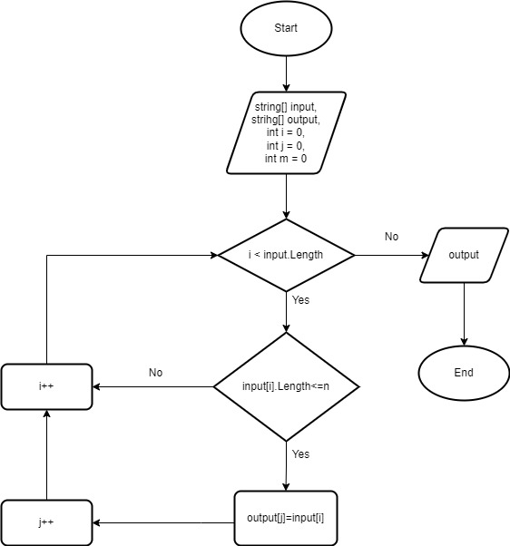

# Итоговая проверочная работа.

## Задача.
Написать программу, которая из имеющегося массива строк формирует массив из строк, длина которых меньше либо равна 3 символа. Первоначальный массив можно ввести с клавиатуры, либо задать на старте выполнения алгоритма. При решении не рекомендуется пользоваться коллекциями, лучше обойтись исключительно массивами.

**Решение задачи.**

1. Объявляем переменные.
2. Вводим размерность массива и его элементы.
3. Проходим по стартовому массиву в цикле и проверяем, подходит ли элемент условию длина символов <= 3.
4. Если элемент подходит под условие, то добавляем его в массив. Если не подходит, то пишем, что таких элементов нет.